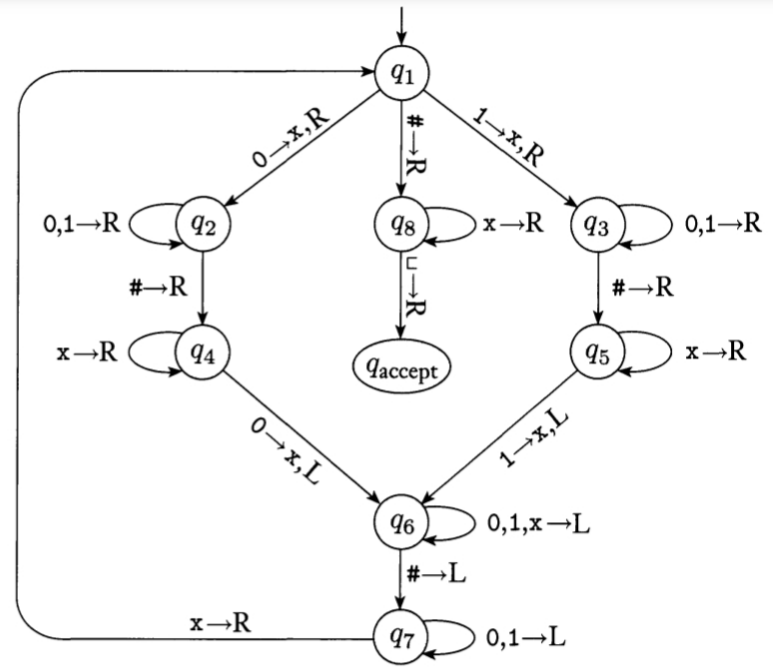
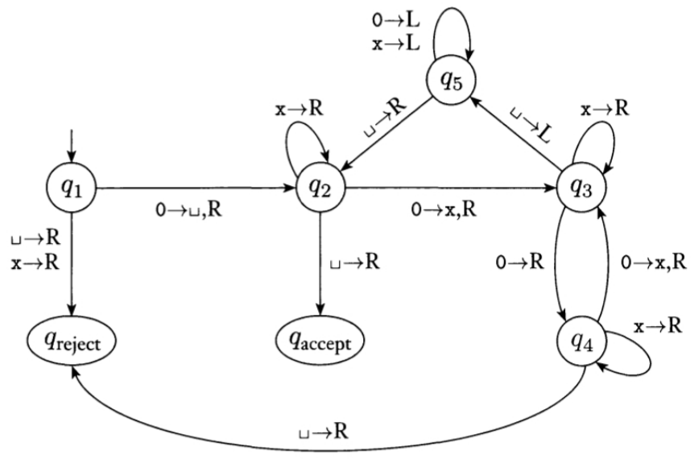

# Lesson 02 - Computation: What Is It and Why Study It?

> 主要介绍了什么是”计算“，以及一种用于解释可计算性理论的一种重要计算模型——”图灵机“

## What is Computation

Computation（计算）的定义：计算、推演或者计数的过程

还是不同的人有不同的看法。

## Turing Machine

图灵机是用于**可计算性理论**（Computability）的一种计算模型。

**可计算性理论**（下一节的内容）：哪些东西是可以计算的，哪些东西是不能计算的。说的通俗一点就是判断问题在有限时间内算不算的出来，哪些问题算的出来，哪些算不出来。

图灵机则是图灵提出的一种计算模型，他模拟了人类使用纸笔进行数学运算的过程。图灵证明了可计算的问题就是图灵机所能得出答案的问题。那么要研究哪些问题是可计算的，只需要从这个具体的例子中判断即可。这也印证了第一节课中讲的那张图（现实世界问题通过抽象来解决）。

接下来，让我们回到图灵机本身：

### 图灵机设计想法

模拟人类用笔和纸进行演算，图灵机分别使用**读写头**和**纸带**。

- 纸带（tape）：像试卷一样，上面可以有输入的题目，也可以用来打草稿，纸带可以是两段都无限长的，也可以是一段有限，另一端无限长的；
- 读写头（Read/Write head）：像眼睛和笔一样，可以看到纸带上读写头所在的地方的内容，修改该处的内容，或者从纸带一个地方移动到另一个地方
- 控制单元（control unit）：控制读写头的行为

### 图灵机的状态（state）

状态（state）定义：由当前**读写头位置**和**纸带内容**组成

- **初始状态**（initial state）：纸带上只有输入的字符串（string），其他地方都是空白。是**计算过程**（computation process）开始的起点
- **接受和拒绝状态**（accept and reject states）：这两种状态看做图灵机的输出，并且在运行到这两个状态时会终止图灵机的运行，如果没有进入这两个状态，图灵机会永远运行下去，永不停机（never halting）

**计算过程**（computation process）：由有限或无限的执行步骤序列组成

图灵机有三种运行结果：

1. **accept and halt**
2. **reject and halt**
3. **never halting**

### 需要用到的数学定义及符号

来，整点数学！

- 或：表示alphabet，字母表，符号的非空有限集
- **string**：字符串，有限长度的符号序列，通常用小写字母表示，如
- ：表示中字符所有可以组成的string

- ：为字符串时，这表示字符串的长度，即符号个数
- ：空字符串，长度为零，即

- ：反向字符串，对于字符串，，

- ：拼接字符串，将字符串添加到字符串的后面
- ：自己头尾相接拼自己k次
- **prefix**：前缀，如果存在一个字符串，使得，则字符串是字符串的**prefix**
- **proper prefix**：真前缀，如果存在一个字符串，使得，并且，则字符串是字符串的**proper prefix**（显然此情况下，需要是一个非空字符串）

- ：基于字母表的Language（语言），字母表中部分（有意义的）字符串组成的集合
- **prefix-free**：这是针对Language的属性，即该集合中没有任何一个字符串是另一个字符串的proper prefix
- ：当X和Y为集合时，表示两个集合的**笛卡尔积**（Cartesian product），即，**元组tuple**的集合。元组应当理解为不同种类元素的**组合**，这样的组合通常是有意义的，比如如果X和Y都为数集，它们的笛卡尔积其实就是**坐标**的集合

总结一下：alphabet是字符的集合，是字符串的集合，language也是字符串的集合

### 图灵机的正式定义

一个图灵机被定义为一个七元组，，且都为有限集：

1. 是state（状态号）的集合
2. 是输入字母表，**就代表可以作为输入的符号有哪些**，不包含空字符（blank symbol）□
3. 是纸带字母表，**代表纸带上会有的符号有哪些**，□并且
4. 是状态转移函数，
5. 是初始状态
6. 是接受状态
7. 是拒绝状态，并且

#### 其中最难理解的是状态转移函数

首先这是一个函数，是一种映射关系

- 左边是状态与纸带字母表的字符的元组
- 右边是状态、纸带字母表的字符和的元组

最后的代表读写头的操作集合，左移和右移

我们来举个例子，假设□

那么其中一个状态转移函数可以为□

### 状态转移函数的表示方式

1. 表格（第一列为状态，第一行表示读到的符号，内容是相对应的操作）
2. 有向图（状态为节点，转移方式为图的边），边的描述公式为，即如果读到的符号为x，则将其改为符号y，并向Direction方向移动，边需要由当前状态指向描述所对应的下一状态。例子请看下面的示例图灵机

### 两个示例图灵机

#### M1

功能：检测#前后的字符串是否相同

思想：让读写头左右横跳，判断对应位置的符号是否相同

#### M2

功能：检测输入中0的个数是不是2的幂

思想：每次划去一半的0，某次剩的0为大于1的奇数就reject，若为1则accept

### Configuration（瞬像、格局）

当前状态、当前纸带内容和当前读写头的位置的设定被叫做一个**configuration**

configuration可以表示为，其中，u、v为字符串，q为当前状态，这表示当前状态为q，纸带内容为uv，当前的读写头在v字符串的第一个符号。

**yield**（产生）：如果configuration C1可以一步到达configuration C2则说**C1 yield C2**

1. start configuration：，初始状态为q0，且读写头在最左侧

2. halting configuration：不yield任何configuration的configuration

   - accept configuration：状态为时的configuration

   - reject configuration：状态为时的configuration

ps：因为configuration和yield翻译成中文太离谱了所以这些名词就不翻译啦

### 图灵机的变体

1. 多纸带图灵机（都可以找到等价的单纸带图灵机）
2. 非决定性图灵机（状态转换函数由概率决定）

## 啥是computation及为啥要学它

### what

- 由**有限**计算步骤的过程组成
- 预先决定好的**有序**过程

### why

- 探索computation的本质
- 找到设计和实现“电脑”的原则（自动computation）
- computation的限制
- computation的效力和效率

### 可计算和不可计算

- Uncomputable functions：不可以用有限的步骤计算出来的函数（用不停机的TM）
- Computable functions：可以用有限的步骤计算出来的函数
- “Really” computable functions：有效时间内能计算出来的
