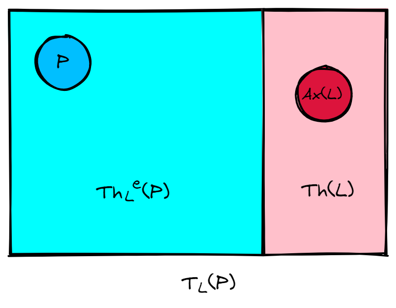

# Lesson 04 - Algorithms

> 主要介绍了“算法”的概念


## Euclidean Algorithm

开始由最古老的算法“求最大公约数“的Euclidean Algorithm来引出算法是什么

我们观察到，算法有如下性质：

- 有明确的目标或结果
- 有输入和输出
- 由有序的步骤组成
- 基本组成部分是：顺序执行（sequence），条件分支（decision）和循环（iteration）
- 必须能够停机


## 算法（Algorithm）

定义：能**产生结果**并且能**在有限时间内结束**的**非模糊的**步骤的**有序集**

前两节课讲的都是浮云，只有算法才是真正为问题提供解决方案的东西。


### 为啥要学

1. 有效地解决问题
2. 高效地解决问题
3. 做一个专业的程序员


### 怎么表示算法

1. **flowchart**（流程图）
   - 不同的命令使用不同的**形状**表示
   - 下图是**顺序查找**的流程图（在排好序的一列数中）


2. **Pseudo-code**（伪代码）
   - 不同的命令使用不同的**符号**表示
   - 下面是**插入排序**的伪代码

INSERTION-SORT(A)

```pseudocode
for j = 2 to A.length
	key = A[j]
	i = j-1
	while i > 0 and A[i] > key
		A[i+1] = A[i]
		i = i - 1
	A[i+1] = key
```

如果是排序好的一列数，其实可以使用**二分查找法**，速度更快（伪代码见课件184页）


### 如何设计算法

这可以说是编程的方法论了，请看：

1. Analysis and specification

   分析问题，清晰地理解需求

2. Algorithm development

   设计算法，使之能够完备地解决这个问题

3. Implementation

   用代码实现这个算法，测试其正确性

4. Maintainance

   有新的需求或需要改动的地方，改动后应当能够依然成功运行


### 三种基本控制结构

#### 1 顺序执行（Sequential Execution）

依次执行下面的action 1到n

```pseudocode
action 1
action 2
...
action n
```

#### 2 条件分支（Conditional Branch）

如果condition这个条件成立，执行action 1，否则执行action 2

```pseudocode
if (condition)
	action 1
else
	action 2
```

#### 3 循环（Loop）

如果condition这个条件成立，执行actions，直到其不成立为止，才会继续执行之后的命令

```
while (condition)
	actions
	...
```


### 算法正确性

对于每一种合法输入，都能输出正确的结果并停下来；对于每一种不合法的输入，都能指出其不合法并停下来，并且要在合理的时间之内。

#### 如何保证算法的正确性？

更通俗地说：如何debug？

答案是：测试！使用各种各样的输入，看程序的输出是否符合预期

但是迪杰斯特拉说：测试只可以找到一些bug，而不能表明其不存在


### 算法效率

选择高效率的算法是很重要的

举个例子，使用**插入排序**排序几百万个数可能要花上几个小时，但是用**快速排序**

可能只需要几分钟。


### 如何验证……？

请看下个part：**Logic**


## Logic（逻辑）

### 啥是逻辑？

探索、阐述和确立有效推理原则的学科

### Formal Logic Systems

两个必要部分：

1. formal language：表示问题的方式 $F(L)$
2. logical consequence relation：逻辑因果关系 $\vdash_L$

$L =_{df} (F(L), \vdash_L)\ where\ \vdash_L =_{df} 2^{F(L)} \rightarrow F(L)$


下面都是我的通俗理解，因为我也没有学过数理逻辑，欢迎大家指正：

$F(L)$：我的理解就是L这个逻辑系统中表示命题的公式组成的集合

$\vdash_L$：我的理解就是蕴含，比如$P \vdash_L C$，就表示在逻辑体系L中，命题P可以推断出命题C，读作“turnstile the subscript L”

$Ax(L)$：每个逻辑系统不证自明的公理

$Th(L)$：set of all logical theorems，不需要前提，仅由公理就可以推断出来的

$P$：经验前提，命题的集合，$P \subseteq F(L)$

$Th_L\ ^e(P)$：在L逻辑系统中，在命题P成立的前提下，可以推断出来的$Th(L)$之外的东西

$T_L(P)$：$Th(L)$和$Th_L\ ^e(P)$的并集，实际上就是P成立时，所有成立的命题组成的集合

老师给的图有点迷惑性，于是我就又画了一个：



注意：$Th(L) \cap Th_L\ ^e(P) = \emptyset$！而$P \subseteq Th_L\ ^e(P)$，$Ax(L) \subseteq Th(L)$


最后，要说的是，**算法是逻辑的产物，要想证明算法的正确性，还得靠逻辑本身！**