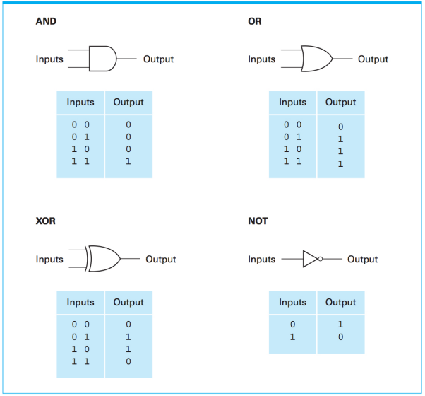
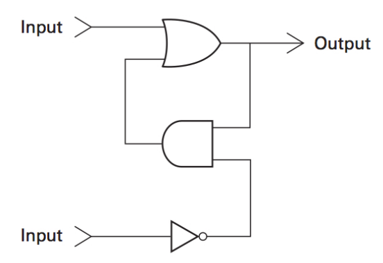

# Lesson 06 - Data Storage

> 主要介绍了硬件层面的数据存储方式

## 位（bit）

### 计算机为何用二进制？

计算机为什么非要使用二进制呢？十进制不香吗？

计算机内部是由电路构建成的，流通在电路元器件之间的是**电流**。既然电流可以流经各元器件，自然不难想到，让电流作为信息的载体。如何将电流解读为信息呢？电流只有两种**最稳定**的状态——有电流和没电流（高电平和低电平），把这两种状态解读为两种信息就好了。这限制了我们表示一个数字的任意一位的时候，只能用两个数字（对应两个状态），于是人们就决定让**低电平代表0、高电平代表1**，每一位都用0和1去表示数，这恰好就是二进制。

### 怎么把电流状态保持下来？

计算机得记住信息才行，但在一般的电路里，电流流过后信息就不在了。那我们如何记住“刚刚这里电流流过”这个信息呢？这就要用到一个重要的元器件**Flip-Flop**（触发器），这个东西能将信息保存下来。

为了学习触发器，我们需要学习以下几样东西：

### logical operations（逻辑操作）

我们也可以把低电平（0）看成False，高电平（1）看成True，于是就有了对这些真值的逻辑操作。基本的四种逻辑操作有：AND（与）、OR（或）、NOT（非）和XOR（异或）。这些逻辑操作也被叫做布尔操作，为了纪念数学家布尔，也是发明这个数学表示的人。

### Logic gates（逻辑门）

逻辑门就是实现具体逻辑运算的电路。相对应四种基本逻辑操作，基本的逻辑门也有：与门、或门、非门和异或门。任何复杂的逻辑电路都可以由这些门电路组成。下面是每一种逻辑门对应的电路符号以及它们的真值表：

除此之外还有NAND（与非门）和NOR（或非门），很简单，就相当于是在与门和或门后串联一个非门。

### Flip-flop（触发器）

存储bit的核心元器件，下面的图是触发器的一种实现方式：

以下为个人理解：

1. 首先，上下两个input都是一个瞬间的电流，它们几乎不可能同时到达，也就是说**input都为1（都有电流）这种情况是不可能发生的**。
2. 再说说上下两个input所代表的意义：
   - 上输入：**Set**，有电流时将输出设置为1
   - 下输入：**Reset**，有电流时将输出重新设置为0
   - 其他情况（都没有电流）将保持上一个操作所设置的值

### stream（流）

一长串位称为流，为了简化1010101010这样子不太好看懂的01字符串，我们可以将4位4位的流直接转换成16进制。

## Main Memory（主存）

一些像Flip-flop这样可以存储位的东西先组合成小的存储单元**cell**，一般cell的大小都是8个bit，也就是1个byte。而Main Memory就是由大量的cell按顺序排列成的，按照顺序，这些cell们有递增的**address**。

- high-order end，most significant bit：高位端，最高位，指左边
- low-order end，least significant bit：低位端，最低位，指右边

1KB = 1024Byte；1MB = 1024KB；1GB = 1024MB；1TB = 1024GB；……

### RAM和ROM

这是两种存储器的硬件实现：

**RAM**（Random Access Memory）: 

- 随机存取存储器
- 可读可写，但是断电后就都没啦
- 主要分为**SRAM**和**DRAM**两种
  - SRAM（Static RAM）：使用传统的flip-flop，快但昂贵
  - DRAM（Dynamic RAM）：使用电容器，充电时为1，放电时为0，，慢但便宜
- 也是主存的主要硬件构成

**ROM**（Read-Only Memory）：

- 只读存储器
- 不能改变其中的内容，只能读取，但是断电之后可以依然存在（除非你把ROM砸了，里面数据才能损坏掉）
- 制作时就把数据烧写在了存储器里面

### Mass (Secondary) Storage Systems

主存断电就GG并且空间有限，我们还需要二级的存储系统

例如：磁盘、磁带、CD、DVD、闪存盘等等

这些存储系统有如下的优缺点：

- 优点：数据不易失、存储空间大、廉价，并且方便从一台设备转移到另一台设备
- 缺点：需要机械移动，因此读写时间开销更大

### Magnetic Disk（磁盘）

读或写时磁盘会转

1. **Track**：磁道，绕磁盘中心的一个个同心圆
2. **Cylinder**：圆柱，磁盘多层的同半径的磁道的集合
3. **Sector**：扇区，磁道可以被分为一个个小的扇区
4. **Formatting**：初始决定磁道和扇区位置的过程

四个衡量磁盘性能的决定因素：

1. **seek time**：把读写头从一个磁道移到另一个磁道的过程所需要的时间
2. **rotation delay**：由于数据可能在相应磁道的任意位置，一般要旋转一圈才能找到，取平均后，即为旋转半圈的时间
3. **access time**：前两者的和
4. **transfer rate**：数据从磁盘读出的速率

CD（Compact disk）则是使用的反光材料和激光读写头。

CD-DA（Compact disk-digital audio）：一种数据存储格式

Flash memory用电信号输送，不需要机械运动，据说运用了量子隧穿效应，所以说快的一批。

### File

大体上在操作系统这一节才细讲，请看[Lesson 10 - Operating System](./Lesson%2010%20-%20Operating%20System.md)