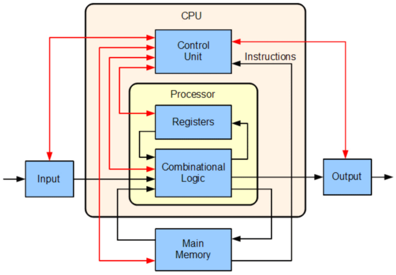

# Lesson 07 - Computer Architecture

> 介绍了计算机组成原理，尤其是冯诺依曼体系结构和Fetch-Execute循环

## 冯诺依曼体系结构（Von Neumann Architecture）

老师再三强调：**冯诺依曼体系结构不是冯诺依曼发明的**

EDSAC也是用这种体系结构，同时它也是世界上第一台能够存储程序的计算机

即使是大半个世纪之后的今天，我们依然还是基于这种体系结构来设计电脑的

### 存储程序的思想（Stored-Program Concept）

将指令进行编码和数据不加区分地混合存储在主存内。

数据和程序在内存中是没有区别的。

曾经一度被认为是冯诺依曼一人发明的，但实际上当时有不少人（如 J. Presper Eckert 和 John Mauchly）都提出了这种想法，但是冯诺依曼是一个把这种思想写成草稿发表出来的（被冯诺依曼截胡？）。

### 什么是计算机？

三个必要需求：

1. Program-control（由程序控制）
2. Internally-stored-program（程序存储在其中）
3. Changeable-program (Self-modifying code)（程序可改变）

第一个这种意义上的计算机：**EDSAC**（Electronic Delay Storage Automatic Calculator）

### 五个组成部分（five component）

1. 存储单元（memory unit）：由一个个的cell组成，每一个cell都有其独一无二的地址，用于存储数据和指令

   - Addressability（可定址性）：存储器中每一个可定址的位置的位长（number of bit）

2. 算数/逻辑单元（arithmetic/logic unit）：ALU，用于对数据进行算数和逻辑运算

   - 算数运算：add，subtract，multiply，divide

   - 逻辑运算：AND，OR，NOT，XOR

3. 输入单元（input unit）：获取数据到存储器中的设备

   - 最早的是打孔卡，后来还有键盘、鼠标、扫描仪等

4. 输出单元（output unit）：让数据展示到计算机之外的设备

   - 例如打印机、显示器等

5. 控制单元（control unit）：控制其他单元的动作，以期保证程序的正常执行

   - 负责`Fetch-Execute Cycle`的运行

此外，还有一些比较重要的概念：

- 寄存器（register）：存放很可能还会被用于计算的值，以及一些特殊的数据（如PC和IR，这两个属于control unit）

  - PC（Program Counter）：存储下一条要执行的指令的地址

  - IR（Instruction Register）：存储当前要执行的指令

- CPU（中央处理器，Central Processing Unit）：因为ALU、控制单元（和寄存器）相互联系较紧密，于是就将它们合在了一起，成为了CPU。

- 分级存储器（Memory Hierarchy）：
  - 为了权衡cost和speed而搞出来的东西
  - Register -> cache -> main memory -> magnetic disk，从左到右：取数据速度越来越慢，但存储容量越来越大，性价比也越来越便宜
  - 其实印象中这个cjd基本直接跳过了

- 总线（Bus）
  - 连接计算机各组件的线缆，各组件凭借它得以相互传输数据
  - 三种数据：address、data、control
  - `bus width`表示bus一次性能传输的位宽是多少

## Fetch-Execute Cycle

“取指令-执行”循环是一般计算机都会采用的程序运行的一种模式

分为三个步骤：

1. **Fetch，取指令**。根据PC寄存器中的地址值从主存中获取下一条指令存放到IR寄存器中，然后找到下一条指令的地址值，存放在PC中；
2. **Decode，解码指令**。根据刚刚获取到IR寄存器中的指令，对该指令进行解码（即分析该指令的具体操作，要使用哪些寄存器等等）；
3. **Execute，执行指令**。根据刚刚解码的指令，执行相应的操作。结束后将回到第一步。

### Pipeline（*）

老师这个没怎么讲，多半不考。

主要思想是相邻两条指令的不同步骤之间可以并行完成。

## 指令（instructions）

### 机器指令（machine instructions）

- （个人的总结）定义了**原**操作，即不可再分的最小功能。所有计算机能做到的操作应当**都能由**一条或多条指令实现。

### 机器语言（Machine Language）

指令的集合和其编码系统被称为一种机器语言，或说，由二进制编码的可以直接被计算机执行的指令组成的集合。

### RISC & CISC architecture

- RISC：Reduced Instruction-Set Computer（精简指令集计算机）
  - 思想：CPU仅实现最少的指令，保证所有功能的实现即可
  - 用在：PowerPC处理器，ARM处理器
  - 优点：指令少，指令所需的存储空间就更少
  - 缺点：复杂的操作需要大量指令来完成
- CISC：Complex Instruction-Set Computer（复杂指令集计算机）
  - 思想：CPU应当能执行各种各样的指令，尽管一部分
  - 用在：Intel处理器，AMD处理器
  - 优点：能用一条语句直接完成较复杂的操作，为了适应目前的电脑功能的增加，CISC更加被大家所推崇
  - 缺点：一些指令之间技术实现上有冗余
