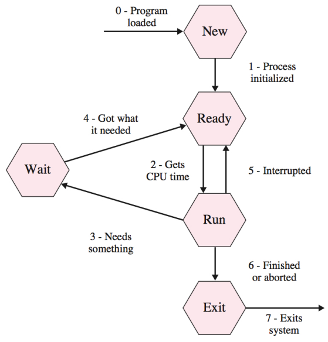

# Lesson 10 - Operating System

> 主要介绍了操作系统是如何让你如此方便地使用计算机的

## 操作系统（OS）是什么

- 一个控制电脑的所有功能的**软件系统**
- 是计算机硬件与用户之间的**接口**，能够管理程序的运行，以及硬件和软件资源的分配

一台裸机（无操作系统）是非常难用的，即使你会用，也不一定能将它安全地操作。而操作系统就可以帮助你管理电脑上的硬件资源和软件资源，让你能够更简单快捷的进行想要的操作。

现在大家可以如此方便地浏览这篇课件，同时开着QQ或着微信，亦或是同时开着Edge或chrome浏览器，双击就能看到一个文件的内容，这都离不开操作系统的帮助。

 

## 如何启动计算机

ROM中存储着叫做**Boot Loader**的程序，这就是启动计算机所必须的程序。

（ROM的数据是烧死在其中的，及时断电也能保持其物理内容）

Boot Loader最开始把硬盘里指定位置的**操作系统**核心程序加载到主存中，直到操作系统能够主动工作为止，将操作系统的首条指令的地址给到PC，开始运行操作系统。从此，操作系统开始控制计算机。

## OS的组成部分

1. 用户接口（User interface）

2. Memory manager 存储器管理

3. Process manager 进程管理

4. Device manager 设备管理

5. File manager 文件管理

### 用户接口（User Interface）

操作系统为完成用户操作而提供的接口。

- Shells：使用文字指令与计算机交互
- GUI（Graphical User Interface）：图形界面

### OS内核（Kernel）

提供了计算机的运行所需要的最基础的一些功能

1. File Manager：文件系统
   - directory（folder）：目录
2. Device Manager：设备驱动（device driver），让计算机能够与接入计算机的外围设备进行信息交互和控制。每种设备都有它独特的设备驱动，它们能翻译一些泛化的操作到更加底层的技术实现。
3. Memory Manager：程序使用的内存空间的保护、回收以及分配
4. Scheduler：调度程序，决定当前什么程序应该被执行
5. Dispatcher：分派程序， 决定一个活动要分配多久的运行时间

## 进程（Process）

我们把某一个程序在计算机里的一次**执行**看做一个进程。

程序和进程的区别：

- 程序是静态的指令的集合
- 进程是程序的执行，是在运行时的

**Process state**：进程的状态

**PCB**（Process Control Block）：存放着执行一个进程所需要的数据

**Context Switch**：上下文切换，将当前在执行的程序从CPU中取出，并将另一个程序载入CPU的过程，涉及到运行状态（寄存器数据）的保存。

### Process States and Transition：

这个是一个类似图灵机里面学过的状态机的一个图：

1. 先看状态：
   - **New**：用户启动了新的程序，新的进程被创建
   - **Ready**：进程一切准备就绪，可以运行但是等待其他进程的运行，等待Process Manager为它分配时间片
   - **Run**：进程正在运行中
   - **Wait**：进程正在等待资源的获取，暂时不能运行
   - **Exit**：进程自动或人为地结束

2. 再看转换过程：
   - **0 - Program loaded**：程序指令被加载进入内存中
   - **1 - Process initialized**：进程需要的空间被分配等一系列准备工作
   - **2 - Gets CPU time**：CPU为当前进程分配了下一个时间片
   - **3 - Needs something**：需要资源，比如需要读写文件等等，准备它一般相对于一个时间片来说需要等待较长时间，所以让这个进入Wait状态，让其他的进程先执行
   - **4 - Got what it needed**：获得资源，比如完成了读写文件的准备，可以立即进行读写，则将状态设回Ready
   - **5 - Interrupted**：不需要资源，一般只是当前CPU时间片结束，所以直接设置为Ready即可
   - **6 - Finished or aborted**：当前进程：“既然大家都不要我了，这我占用的内存就不要了”
   - **7 - Exits system**：当前进程：“我滴任务完成啦，啊哈哈哈哈哈哈哈哈”

### 进程管理（Scheduler和Dispatcher）

- Scheduler负责存放进程所需的一些记录数据，添加新的进程，删除运行结束的进程

- Dispatcher负责分时，决定时间片，切换CPU上执行的进程，它的主要目的就是实现多道程序同时执行

### 中断（Interrupt）

当CPU收到中断（interrupt）信号会停止当前进程的运行，并转变去运行相应的**interrupt handler**（也是一个程序，dispatcher的一部分，被存储在主存的指定位置，决定了如何处理当前的中断信号）。之后Dispatcher会选择当前优先级最高的且状态为Ready的进程执行。

### 死锁（Deadlock）

哲学家进餐问题（Dining Philosophers Problem）：五个哲学家坐在圆桌周围，他们每两个人中间都有一支筷子（总共五只），他们都很矜持，即使饿死都要有两只筷子才肯吃饭。

**Starvation饥饿**：指一个进程长时间无法被处理的情况（影射了哲学家长时间无法吃到饭的问题，比如所有哲学家都拿起左手边的筷子不放，并且都等着右手边的人放下筷子）

死锁发生的四个必要的条件：

1. **Mutual Exclusion**：一个资源只能一个进程使用（一支筷子只能同时被一个人用）
2. **Resource Holding**：拿到了资源就不放（拿了筷子就不放下来了）
3. **No Preemption**：无法重新分配资源（不能抢别人手上的筷子）
4. **Circular Waiting**：两个或多个进程等待的资源形成了一个环（就是上面说的那种情况）

## 内存管理 Memory Management

为进程分配内存，并且做好隔离。

**Logical address**：逻辑地址，程序内使用的地址，需要翻译成实际的物理地址才能访问到真正的数据

**Physical address**：物理地址，在物理设备上的实际地址

**Address binding**：逻辑地址到物理地址的映射

一种比较常见的Address binding的方式是**base and bound**

- base：基址，实际的物理地址从这里开始
- bound：存放分配给当前进程的内存地址的长度

使用base和bound两个寄存器存放实际物理的地址，base+Logical addr = phy addr，bound用于检查访问的地址是否在这个进程能访问的范围之内。

## 文件系统 File System

**File**：文件，有名字的数据集合，被用作于组织第二级内存

- Text file：数据由ASCII或者Unicode码编码组织起来的文件
- Binary file：数据由特定的二进制模式存储的文件

不同的文件类型拥有不同的文件扩展名，操作系统会根据文件类型决定该如何解析其中的数据

文件系统需要提供的操作：创建、删除、打开、关闭、读数据、写数据、改变当前文件指针的位置、往文件的最后添加内容、重命名、复制

### File access（文件访问）

1. 顺序访问：要从头到尾一点点找，好处是不需要存额外的index
2. 直接访问：有index，可以通过index直接访问到想要的数据，好处是访问更快

### File protection（文件保护）

决定了谁可以访问，谁不能访问

Unix操作系统提供了三种权限者分类：Owner、Group和World

除此之外还有操作分类：Read，Write和Execute

### Directories（目录）

是有名字文件的一个集合，更方便管理文件

## 三种主要的操作系统

- Unix：Linux~

- Mac OS X

- Windows：~~世界上最烂的操作系统~~，但是也是最普及的操作系统之一